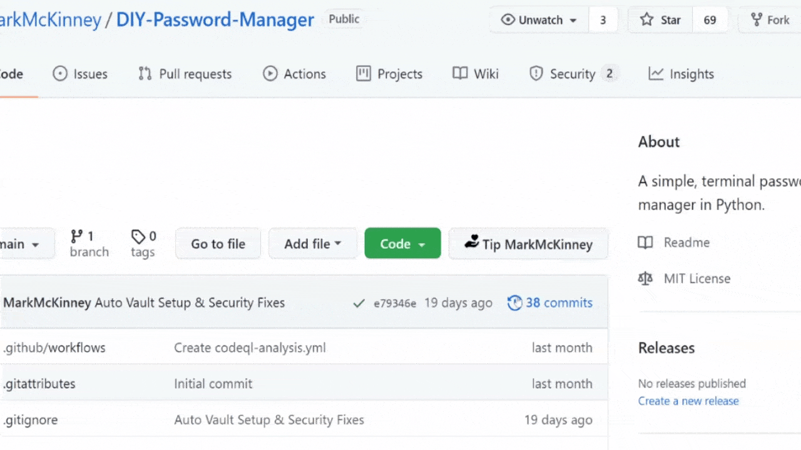

# [BreadJar](https://breadjar.herokuapp.com) - Server Repo

## Get tipped for for your commits!

**Note**: You're currently viewing the repo for the **Server**. If you'd like to see the repo for the server, [visit here](https://github.com/MarkMcKinney/breadjar-extension).

**Description**: If you've used GitHub, you can probably remember a couple times someone built something cool or added something significant to your own project. You may have wanted to say thanks! or support their work. BreadJar is the way to do that...and for others to show their thanks for you!

**Features**:
- 😎 Chrome extension that places a tip button to the latest repo commit.
- 🔗 Redirect to your Buy Me a Coffee URL.
- 📊 Statistics and record keeping for tips received and given.
- 📦 Free and Open-Source!

### [Get started now with BreadJar!](https://breadjar.herokuapp.com)